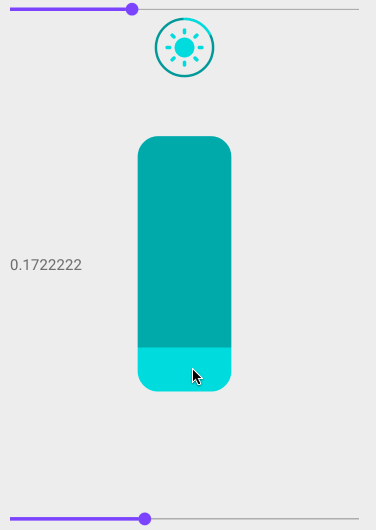
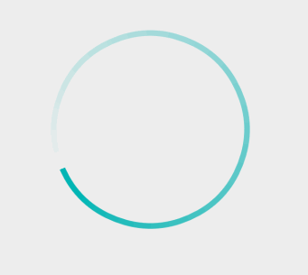
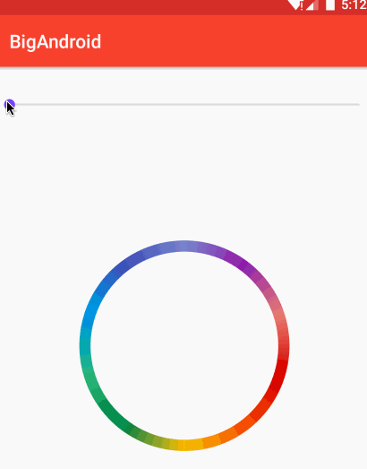

# BigAndroid
>项目需求中遇到的android小组件，选择一部分开源，慢慢积累吧！

## 预览
<div align=center></div>

[apk下载](https://github.com/hustlong/BigAndroid/raw/master/gif/app-debug.apk)

## 模仿iOS的亮度调节交互


[组件源码：垂直滑动进度条](app/src/main/java/cc/biglong/bigandroid/widget/SlideVerticalBar.java)

[组件源码：圆形亮度指示器](app/src/main/java/cc/biglong/bigandroid/widget/DimmerIndicator.java)

## 渐变圆环加载动画


[组件源码](app/src/main/java/cc/biglong/bigandroid/widget/ProgressRingView.java)


## 可以显示进度的圆形指示器
没时间去做更炫酷的显示效果，先这样。

[组件源码](app/src/main/java/cc/biglong/bigandroid/widget/CircleProgress.java)

* 使用方法

```
    <cc.biglong.bigandroid.widget.CircleProgress
        android:id="@+id/circleProgress1"
        android:layout_width="150dp"
        android:layout_height="150dp"/>
```

* 设置属性

```
    mCircleProgress1.setProgress(25);//设置进度
    mCircleProgress1.setMax(100);//设置最大值
    mCircleProgress1.setCenterText("ABCD");//设置中间的文本
    mCircleProgress1.setTextColor(Color.RED);//设置字体颜色
    mCircleProgress1.setTextSize(16);
    mCircleProgress1.setHintColor(Color.GRAY);//设置圆环的未选中部分颜色
    mCircleProgress1.setProgressColor(Color.BLUE);//设置圆环选中部分颜色
    mCircleProgress1.setThickness(10);//设置圆环的厚度

    //你也可以在xml里面设置初始化属性，例如：
    //app:center_text="ABCD"
```

* 动图展示


## 彩虹环自转动画
目前可以设置颜色、自转速度

[组件源码](app/src/main/java/cc/biglong/bigandroid/widget/ColorsFlowCircle.java)

* xml中使用方法
```
<cc.biglong.bigandroid.widget.ColorsFlowCircle
        android:id="@+id/flow"
        android:layout_width="240dp"
        android:layout_height="240dp"/>
````

* java 设置属性
```
mFlow.setColors(mColors); //设置颜色组，数量不限
mFlow.setAnimDuration(3000); //设置自转一圈时间，毫秒
```




