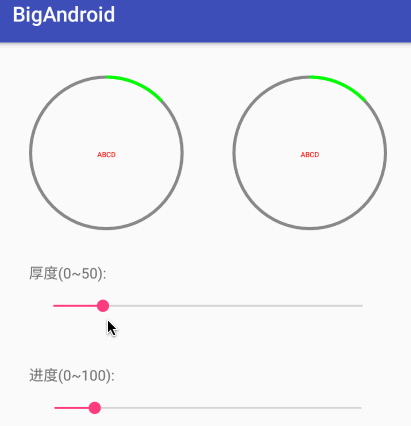

# BigAndroid
>开源android小组件，慢慢积累吧！

### 可以显示进度的圆形指示器
没时间去做更炫酷的显示效果，先这样。

* 使用方法

```
    <cc.biglong.bigandroid.widget.CircleProgress
        android:id="@+id/circleProgress1"
        android:layout_width="150dp"
        android:layout_height="150dp"/>
```

* 设置属性

```
    mCircleProgress1.setProgress(25);//设置进度
    mCircleProgress1.setMax(100);//设置最大值
    mCircleProgress1.setCenterText("ABCD");//设置中间的文本
    mCircleProgress1.setTextColor(Color.RED);//设置字体颜色
    mCircleProgress1.setTextSize(16);
    mCircleProgress1.setHintColor(Color.GRAY);//设置圆环的未选中部分颜色
    mCircleProgress1.setProgressColor(Color.BLUE);//设置圆环选中部分颜色
    mCircleProgress1.setThickness(10);//设置圆环的厚度

    //你也可以在xml里面设置初始化属性，例如：
    //app:center_text="ABCD"
```

* 动图展示



